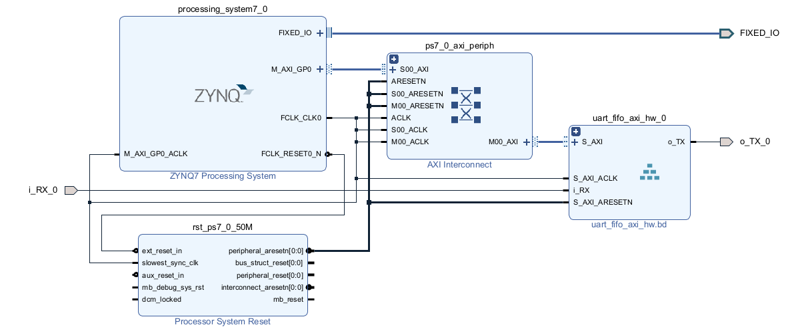

# Daftar Isi

- [Daftar Isi](#daftar-isi)
- [UART Design](#uart-design)
- [Percobaan FIFO](#percobaan-fifo)
- [Percobaan UART Controller](#percobaan-uart-controller)
- [Percobaan UART Controller + FIFO](#percobaan-uart-controller--fifo)
- [Percobaan UART Controller + FIFO + AXI4 Lite Interface](#percobaan-uart-controller--fifo--axi4-lite-interface)
- [Percobaan UART Controller + FIFO + AXI4 Lite Interface + ZYNQ (PS)](#percobaan-uart-controller--fifo--axi4-lite-interface--zynq-ps)

# UART Design

Dokumen ini menjelaskan rancangan blok desain UART dengan komponen utama sebagai berikut:

1. **`uart_tx.v`**  
   Bertindak sebagai pengontrol UART untuk transmisi data (UART TX controller).
2. **`uart_rx.v`**  
   Bertindak sebagai pengontrol UART untuk penerimaan data (UART RX controller).
3. **`baudrate_generator.v`**  
   Bertindak sebagai pencacah clock, di mana setiap 16 tick adalah periode setiap bit baudrate.
4. **`fifo_uart_tx`**  
   Buffer UART TX yang dihasilkan menggunakan FIFO generator.
5. **`fifo_uart_rx`**  
   Buffer UART RX yang dihasilkan menggunakan FIFO generator.
6. **`axi_lite_ifc.v`**  
   Interface AXI Lite Slave yang berfungsi sebagai penghubung antara PL (Programmable Logic) dan PS (Processing System).

---

# Percobaan FIFO
Pengujian blok FIFO dengan `tb_fifo.v`, termasuk konfigurasi dan simulasi penulisan serta pembacaan data dari FIFO.

<div align="center">
  
  <p><em>FIFO Block Design</em></p>
</div>

<div align="center">
  
  <p><em>FIFO Configuration</em></p>
</div>

<div align="center">
  
  <p><em>FIFO Write and Read</em></p>
</div>

---

# Percobaan UART Controller
Pengujian modul UART TX dan UART RX dengan `tb_uart.v` untuk memastikan data dapat dikirim dan diterima dengan benar.

<div align="center">
  
  <p><em>UART Block Design</em></p>
</div>

<div align="center">
  
  <p><em>UART Simulation Waveform</em></p>
</div>

---

# Percobaan UART Controller + FIFO
 Integrasi modul UART dengan buffer FIFO untuk memverifikasi kemampuan modul dalam menangani data dengan buffering. Percobaan dilakukan dengan `tb_uart_fifo.v`

<div align="center">
  
  <p><em>UART + FIFO Block Design</em></p>
</div>

<div align="center">
  
  <p><em>FIFO Write Waveform</em></p>
</div>

<div align="center">
  
  <p><em>FIFO Read Waveform</em></p>
</div>

---

# Percobaan UART Controller + FIFO + AXI4 Lite Interface
Pengujian modul UART yang terintegrasi dengan FIFO dan interface AXI4 Lite untuk memastikan komunikasi antar modul dan PS.

<div align="center">
  
  <p><em>UART + FIFO + AXI Block Design</em></p>
</div>

<div align="center">
  
  <p><em>Write Data to FIFO TX</em></p>
</div>

<div align="center">
  
  <p><em>Read Data from FIFO RX</em></p>
</div>

---

# Percobaan UART Controller + FIFO + AXI4 Lite Interface + ZYNQ (PS)
Pengujian keseluruhan sistem menggunakan hardware sunggunahn (Z-Turn Board), mencakup UART, FIFO, AXI4 Lite, dan Processing System (PS).
Pada sisi hardware, pin Tx dan Rx harus dihubungkan untuk skenario loopback. Dibutuhkan tambahan UART PS untuk debugging.
<div align="center">
  
  <p><em>UART + FIFO + AXI + ZYNQ Block Design</em></p>
</div>

<div align="center">
  
  <p><em>UART + FIFO + AXI + ZYNQ Block Design</em></p>
</div>

Program untuk Processing System menggunakan IDE **Vitis 2023.2**.
Berikut program vitis
```c
// Alamat register
#define ADDR_REG0 0x00 // Uart divider [10:0]
#define ADDR_REG1 0x04 // Uart Tx Data [7:0]
#define ADDR_REG2 0x08 // Uart Rx Data [7:0]
#define ADDR_REG3 0x0C // Uart Flag [2:0] (bit 1 = Rx Buffer Empty, Bit 0 = Tx Buffer Full)

// Fungsi untuk mengatur baudrate
uint8_t uartpl_setBaudrate(uint32_t baudrate){
    u32 divisor = 50000000/baudrate;
    /**
    * Set divider baudrate
    * Freq. Clock (modul uart) = 50MHz
    * Desired Baudrate = 115200
    * Divider = 50000000/115200
    * Divider = 434
    */
    Xil_Out32(XPAR_AXI_LITE_SLAVE_0_BASEADDR + ADDR_REG0, divisor);
}

// Fungsi untuk mengecek ketersediaan data di FIFO RX
uint8_t uartpl_available() {
    uint32_t uartpl_status = Xil_In32(XPAR_AXI_LITE_SLAVE_0_BASEADDR + ADDR_REG3);
    return (uartpl_status & 0x02) == 0 ? 1 : 0; // Jika bit 2 (RxEmpty) == 0, data tersedia
}

// Fungsi untuk membaca data dari FIFO RX
uint8_t uartpl_read() {
    return (uint8_t)(Xil_In32(XPAR_AXI_LITE_SLAVE_0_BASEADDR + ADDR_REG2) & 0xFF); // Ambil byte data (bit 7:0)
}

// Fungsi untuk menulis data ke FIFO TX
void uartpl_sendMessage(const char *msg) {
    while (*msg != '\0') { // Iterasi hingga akhir string
        Xil_Out32(XPAR_AXI_LITE_SLAVE_0_BASEADDR + ADDR_REG1, *msg); // Kirim satu byte
        msg++; // Lanjut ke byte berikutnya
    }
}


int main(){
    init_platform();
    print("init system\n");
    sleep(1);
    uartpl_setBaudrate(256000);
    sleep(1);


    char *msg = "Teks ini dirancang untuk memenuhi panjang 512 karakter. Dalam dunia digital, kejelasan dan efisiensi menjadi sangat penting. Setiap kata harus memberikan makna, tanpa ruang untuk hal-hal yang tidak relevan. Menggabungkan elemen seperti teknologi, kreativitas, dan inovasi adalah cara terbaik untuk menciptakan sesuatu yang berharga. Panjang teks ini memastikan konten tetap padat dan informatif, memberikan nilai bagi siapa saja yang membacanya. Fokus, ketelitian, dan keseimbangan adalah kunci utama lo iki josss\n";
   
    while(1){
        uartpl_sendMessage(msg);
        for(uint8_t i=0; i<2; i++){
            printf("hello : %d \n", i);
            sleep(1);
        }

        while(uartpl_available()){
            u8 inByte = uartpl_read();
            printf("%c", inByte);
        }
    }

    cleanup_platform();
    return 0;

}
```

